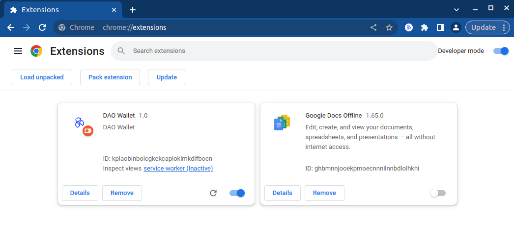

# DAO Wallet

DAO Wallet is WebAssembly Web3 wallet that enables users to interact with decentralized applications (DApps) 
and blockchain networks seamlessly. It allows users to securely manage their cryptocurrency assets and NFT, including sending and receiving transactions.

## Features
- **WebAssembly**: The wallet is built using WebAssembly, which offers a fast and secure environment for running cryptocurrency operations in a browser.
- **Polywrap Technology**: The wallet is built using [Polywrap](https://polywrap.io/), a powerful technology for creating modular and upgradeable blockchain integrations.
- **Secure Key Management**: The wallet supports secure key management, including generation of new keys, importing existing keys, and securely storing the keys.
- **NFT and Asset Management**: Users can view and transfers their NFT collections.
- **Transaction Management**: Users can create, sign, and broadcast transactions.
- **DApp Integration**: The wallet integrates with DApp application, allowing users to interact with Frontend Application. [Demo application](https://github.com/ConsiderItDone/dao-wallet-demo) is available.
- **Multi-platform**: The wallet can be accessed from any device with a modern web browser, supporting Windows, macOS, Linux, Android, and iOS.

## Getting Started

### Prerequisites

- `Node.js` and `yarn` must be installed on your machine.

### Installation

1. Clone the repository: `git clone https://github.com/ConsiderItDone/dao-wallet.git`
2. Navigate to the project directory: `dao-wallet`
3. Install dependencies: `yarn install`

### Build and Run

1. Build the extension: `yarn build`
2. Upload extension to chrome extensions
   
   * Enable developer mode
   * Click "Load unpacked" button
   * Select `build` directory

3. DaoWallet extension now in Chrome extensions

## License
This project is licensed under the [Apache License](LICENSE).
